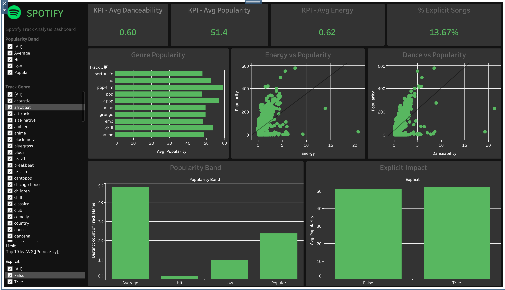

# 🎧 Spotify Track Analysis Dashboard

<p align="center">
  
</p>

## 🚀 Project Overview

This project delivers a deep-dive analysis of Spotify track data, uncovering the intricate factors that drive song popularity. By leveraging a dataset of over **114,000 tracks** across **125 genres**, we've built an interactive **Tableau Dashboard** that provides actionable insights for artists, producers, and data enthusiasts.

### 🎯 Core Objectives:
* **Popularity Drivers:** Decode what makes a track a "Hit."
* **Genre Benchmarking:** Identify high-performing musical categories.
* **Audio Engineering:** Analyze the impact of danceability, energy, and valence.
* **Content Strategy:** Evaluate the influence of explicit content on engagement.

---

## 📊 Key Performance Indicators (KPIs)

Based on the comprehensive analysis of the Spotify dataset, here are the baseline metrics:

| Metric | Value |
| :--- | :--- |
| **Average Popularity** | `51.4 / 100` |
| **Average Danceability** | `0.60` |
| **Average Energy** | `0.62` |
| **Average Duration** | `3.80 Minutes` |
| **Explicit Content** | `13.67%` |

---

## 🛠️ Tech Stack & Tools


* **Tableau Desktop:** Advanced data visualization and interactive dashboarding.
* **Microsoft Excel:** Initial data cleaning and feature engineering.
* **Python (Pandas):** Data validation, KPI extraction, and automated cleaning.

---

## 🔍 Interactive Visualizations

The dashboard is divided into several strategic views:

1.  **Genre Popularity Analysis:** A ranked bar chart highlighting top genres like *Sertanejo*, *Pop*, and *K-Pop*.
2.  **Danceability vs. Popularity:** A correlation scatter plot revealing how rhythm affects track success.
3.  **Energy vs. Popularity:** Understanding the balance between high-energy tracks and listener retention.
4.  **Popularity Band Distribution:** A categorical breakdown into **Hit**, **Popular**, **Average**, and **Low** tiers.
5.  **Explicit Content Impact:** A comparative analysis of audience engagement for explicit vs. non-explicit tracks.

---

## 🧹 Data Engineering Workflow

The raw data underwent a rigorous cleaning process to ensure accuracy:
- **Column Pruning:** Removed redundant indices and meta-columns.
- **Unit Conversion:** Transformed track duration from milliseconds to minutes for human-readable analysis.
- **Categorization:** Developed custom logic for **Popularity Bands** (0-25: Low, 26-50: Average, 51-75: Popular, 76-100: Hit).
- **Binning:** Segmented audio features (energy, danceability) into discrete levels for distribution modeling.
- **Integrity Checks:** Resolved missing values and ensured data type consistency for Tableau compatibility.

---

## 💡 Key Insights

* **The "Hit" Formula:** Tracks with higher danceability and energy levels show a statistically significant correlation with higher popularity scores.
* **Competitive Landscape:** Over 60% of the tracks fall into the "Average" or "Low" bands, highlighting the difficulty of breaking into the top tier.
* **Genre-Specific Trends:** Certain genres have a much higher "Popularity Ceiling" than others, regardless of audio features.
* **Explicit Content:** The impact of explicit content is highly genre-dependent, with significant popularity boosts in specific categories like Rap and Urban Pop.

---

## 📂 Project Structure

```bash
SpotifyAnalysis/
├── Assets/             # Dashboard screenshots and branding
├── CleanedData/        # Processed datasets (Excel/CSV)
├── Dashboard/          # Final Tableau Workbook (.twbx)
├── Raw Data/           # Original source dataset from Kaggle
└── readme.md           # Project Documentation
```

---

## 🤝 Let's Connect!

**Pratiti Paul**  
*Data Analyst & Visualization Specialist*  

Made with ❤️ and a lot of ☕